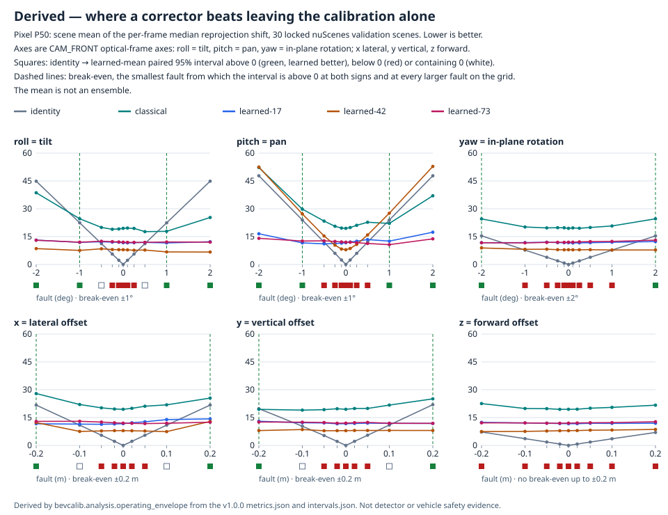

# bev-calibration-lab

[正體中文](README.md) · [Website](https://kuotunyu.github.io/bev-calibration-lab/) · [Documentation](docs/README.en.md) · [Experiment card](docs/experiment-card.en.md) · [Model card](docs/model-card.en.md) · [Known issues](docs/errata.md)

How much does a small error in LiDAR-camera calibration metadata cost, and how much of
it can a corrector get back? A controlled fault study on nuScenes.

## TL;DR

- On 30 locked nuScenes validation scenes, a +1° tilt or pan error in the CAM_FRONT–LIDAR_TOP extrinsic shifts projected LiDAR points by 22.44–23.95 px (scene mean of the per-frame median). <!-- bind: 30 = metrics#/runs/identity/roll:1/pixel_frame_p50_px/support/scenes ; 22.44 = metrics#/runs/identity/roll:1/pixel_frame_p50_px/value ; 23.95 = metrics#/runs/identity/pitch:1/pixel_frame_p50_px/value -->
- A ConvNeXtV2-Tiny corrector (mean of three seeds) beats a single-frame edge-alignment optimizer on rotation, translation, pixel error and recovery in all 60 conditions of the fault grid (54 single-axis faults plus the zero-fault condition, which the grid lists once per axis). <!-- bind: 60 = envelope#/interval_counts/classical->learned-fixed-three-seed-mean/rotation_geodesic_deg/after_better ; 60 = envelope#/interval_counts/classical->learned-fixed-three-seed-mean/translation_norm_cm/after_better ; 60 = envelope#/interval_counts/classical->learned-fixed-three-seed-mean/pixel_frame_p50_px/after_better ; 60 = envelope#/interval_counts/classical->learned-fixed-three-seed-mean/recovery_rate_pct/after_better ; 60 = envelope#/grid/conditions ; 54 = envelope#/grid/injected_fault_conditions -->
- Seeds 17 and 73 keep a residual rotation error of 0.62–0.83° whatever the fault. Compared with leaving the calibration alone, the corrector's pixel error is therefore lower, with the paired 95% interval above zero, only from ±1° tilt or pan, ±2° in-plane rotation or ±0.2 m lateral or vertical offset, and with no fault it moves a correct calibration by 0.60° (+10.55 px). <!-- bind: 0.62 = envelope#/residual/learned-73/rotation_geodesic_deg/min ; 0.83 = envelope#/residual/learned-17/rotation_geodesic_deg/max ; 1 = envelope#/break_even/identity->learned-fixed-three-seed-mean/roll/magnitude ; 1 = envelope#/break_even/identity->learned-fixed-three-seed-mean/pitch/magnitude ; 2 = envelope#/break_even/identity->learned-fixed-three-seed-mean/yaw/magnitude ; 0.2 = envelope#/break_even/identity->learned-fixed-three-seed-mean/x/magnitude ; 0.2 = envelope#/break_even/identity->learned-fixed-three-seed-mean/y/magnitude ; 0.60 = intervals#/comparisons/identity->learned-fixed-three-seed-mean/pitch:0/rotation_geodesic_deg/after ; 10.55 = intervals#/comparisons/identity->learned-fixed-three-seed-mean/pitch:0/pixel_frame_p50_px/after -->
- Implication, not tested here: online recalibration needs a miscalibration detector or an abstain gate in front of the corrector.

## Key findings

The table gives pixel P50: the scene mean of each frame's median shift, in pixels,
between LiDAR points projected with the true calibration and with the calibration each
method ends with (for identity, the faulty one). Lower is better. Fault names follow
the [axis table](#faults-and-fault-axes); the zero-fault row is shared by all axes.
Negative levels, the other estimands and every paired interval are in the
[full evidence report](https://kuotunyu.github.io/bev-calibration-lab/evidence/).

<!-- bind-table: metrics#/runs/{column}/{row}/pixel_frame_p50_px/value -->
| Fault | `identity` | `classical` | `learned-17` | `learned-42` | `learned-73` |
| --- | ---: | ---: | ---: | ---: | ---: |
| none `pitch:0` | 0.00 | 19.46 | 11.70 | 7.94 | 12.01 |
| tilt 0.5° `roll:0.5` | 11.23 | 17.68 | 11.89 | 7.78 | 11.91 |
| tilt 1° `roll:1` | 22.44 | 17.86 | 11.61 | 6.76 | 12.11 |
| tilt 2° `roll:2` | 44.87 | 25.30 | 12.24 | 6.69 | 12.03 |
| pan 0.5° `pitch:0.5` | 11.99 | 22.75 | 13.43 | 15.89 | 11.31 |
| pan 1° `pitch:1` | 23.95 | 22.12 | 12.57 | 27.62 | 10.67 |
| pan 2° `pitch:2` | 47.78 | 37.02 | 17.38 | 52.82 | 13.80 |
| in-plane 2° `yaw:2` | 15.41 | 24.61 | 12.33 | 7.79 | 13.09 |
| lateral 0.2 m `x:0.2` | 21.74 | 25.50 | 14.29 | 12.94 | 12.49 |
| vertical 0.2 m `y:0.2` | 21.95 | 25.09 | 11.84 | 8.04 | 11.88 |
| forward 0.2 m `z:0.2` | 6.99 | 21.67 | 11.93 | 8.61 | 12.75 |

- **Learned versus classical.** The fixed-three-seed learned mean has lower rotation error, translation error, pixel P50 and pixel P90, and higher recovery, than classical in 60 of 60 conditions (paired 95% scene-bootstrap interval above zero). Classical wins 60 of 60 on its own objective, the edge-alignment score, so the proxy it optimizes does not track the pose. <!-- bind: 60 = envelope#/interval_counts/classical->learned-fixed-three-seed-mean/pixel_frame_p90_px/after_better ; 60 = envelope#/interval_counts/classical->learned-fixed-three-seed-mean/edge_score_px/before_better -->
- **Learned versus leaving the calibration alone.** On pixel P50 the learned mean is better than identity in 14 of 60 conditions (tilt and pan at ±1° and ±2°, in-plane at ±2°, lateral and vertical at ±0.2 m, never forward), worse in 40 (including the zero-fault condition, counted once per axis) and inconclusive in 6. Classical is better than identity in 4 of 60. <!-- bind: 14 = envelope#/interval_counts/identity->learned-fixed-three-seed-mean/pixel_frame_p50_px/after_better ; 60 = envelope#/interval_counts/identity->learned-fixed-three-seed-mean/pixel_frame_p50_px/total ; 1 = envelope#/break_even/identity->learned-fixed-three-seed-mean/roll/magnitude ; 1 = envelope#/break_even/identity->learned-fixed-three-seed-mean/pitch/magnitude ; 2 = envelope#/break_even/identity->learned-fixed-three-seed-mean/yaw/magnitude ; 0.2 = envelope#/break_even/identity->learned-fixed-three-seed-mean/x/magnitude ; 0.2 = envelope#/break_even/identity->learned-fixed-three-seed-mean/y/magnitude ; 40 = envelope#/interval_counts/identity->learned-fixed-three-seed-mean/pixel_frame_p50_px/before_better ; 6 = envelope#/interval_counts/identity->learned-fixed-three-seed-mean/pixel_frame_p50_px/inconclusive ; 4 = envelope#/interval_counts/identity->classical/pixel_frame_p50_px/after_better -->
- **A residual floor.** Across all 60 conditions the residual rotation error stays between 0.63 and 0.83° for seed 17 and between 0.62 and 0.74° for seed 73, and the residual translation between 2.40 and 4.05 cm for the three seeds. Faults smaller than this floor therefore end with a larger error than they started with, which is consistent with both the weak recovery and the zero-fault degradation. <!-- bind: 60 = envelope#/grid/conditions ; 0.63 = envelope#/residual/learned-17/rotation_geodesic_deg/min ; 0.83 = envelope#/residual/learned-17/rotation_geodesic_deg/max ; 0.62 = envelope#/residual/learned-73/rotation_geodesic_deg/min ; 0.74 = envelope#/residual/learned-73/rotation_geodesic_deg/max ; 2.40 = envelope#/residual/learned-73/translation_norm_cm/min ; 4.05 = envelope#/residual/learned-42/translation_norm_cm/max -->
- **Zero fault.** With no fault injected, the learned mean moves the calibration by 0.60° and 2.58 cm and adds 10.55 px of pixel error (paired 95% interval of the improvement, identity minus learned: -11.72 to -9.47 px); classical moves it by 1.08° and 12.55 cm and adds 19.46 px. <!-- bind: 0.60 = intervals#/comparisons/identity->learned-fixed-three-seed-mean/pitch:0/rotation_geodesic_deg/after ; 2.58 = intervals#/comparisons/identity->learned-fixed-three-seed-mean/pitch:0/translation_norm_cm/after ; 10.55 = intervals#/comparisons/identity->learned-fixed-three-seed-mean/pitch:0/pixel_frame_p50_px/after ; -11.72 = intervals#/comparisons/identity->learned-fixed-three-seed-mean/pitch:0/pixel_frame_p50_px/interval/low ; -9.47 = intervals#/comparisons/identity->learned-fixed-three-seed-mean/pitch:0/pixel_frame_p50_px/interval/high ; 1.08 = intervals#/comparisons/identity->classical/pitch:0/rotation_geodesic_deg/after ; 12.55 = intervals#/comparisons/identity->classical/pitch:0/translation_norm_cm/after ; 19.46 = intervals#/comparisons/identity->classical/pitch:0/pixel_frame_p50_px/after -->
- **Seed 42 does not correct pan.** Its residual pan error is 1.99° and 2.04° at pan faults of -2° and +2°, against 0.04° at zero fault. The [operating-envelope note](docs/analysis/operating-envelope.md) has the details. <!-- bind: 1.99 = envelope#/pan_residual/learned-42/pitch:-2 ; 2.04 = envelope#/pan_residual/learned-42/pitch:2 ; 0.04 = envelope#/pan_residual/learned-42/pitch:0 -->



The figure and the counts above are a derived analysis of the released evidence,
recorded with its own content digest and the SHA-256 of every source document it read;
see [the operating envelope](docs/analysis/operating-envelope.md).
The formal [recovery](https://kuotunyu.github.io/bev-calibration-lab/figures/recovery-by-fault-level.svg)
and [BEV error](https://kuotunyu.github.io/bev-calibration-lab/figures/bev-error-by-range.svg)
figures keep every method, seed and condition, with exact values and sources on hover.
Read the [known issues](docs/errata.md) before citing identity recovery at ±0.25°, the
timing stress test or BEV error beyond 10 m.

## Why it matters for autonomous driving

Camera-LiDAR fusion trusts the extrinsic calibration. Mounts shift, sensors are
replaced and structures age, so the calibration a stack believes in can drift from the
physical one without any error being raised: LiDAR depth simply lands on the wrong
image pixels. In SOTIF (ISO 21448) terms, such a drift can be treated as a triggering
condition for fusion errors. The results above argue for monitoring the calibration
and gating any online correction, because an always-on corrector here makes a correct
calibration worse. This is a research study; it claims no compliance with ISO 21448,
ISO 26262 or any other standard.

## Method

### Sensors and cohort

`CAM_FRONT` and `LIDAR_TOP`. The formal cohort is 150 nuScenes scenes: 100 official-train
development scenes, 20 checkpoint-selection scenes (the "calibration" split) drawn
from distinct logs, and 30 official-validation scenes reserved for locked evaluation.
Scene assignment is stratified by location and ordered by token SHA-256, so it is
reproducible and independent of anything measured. The nuScenes mini split is for
development and integration only and never appears in a reported result.

### Faults and fault axes

A fault changes only calibration metadata; no pixel and no LiDAR point is modified.
Each fault is a single-axis rigid transform composed on the camera side of the
CAM_FRONT extrinsic (`assumed = true ∘ fault`). The formal roll, pitch, yaw and x, y, z
are therefore axes of the camera optical frame (x right, y down, z forward), not
vehicle axes.

| Formal label | Axis in the CAM_FRONT optical frame | Physical effect | Identity pixel P50 at 1° or 0.1 m |
| --- | --- | --- | ---: |
| `roll` | x, pointing right | tilt: image content moves up or down | 22.44 px <!-- bind: 22.44 = metrics#/runs/identity/roll:1/pixel_frame_p50_px/value --> |
| `pitch` | y, pointing down | pan: image content moves left or right | 23.95 px <!-- bind: 23.95 = metrics#/runs/identity/pitch:1/pixel_frame_p50_px/value --> |
| `yaw` | z, the optical axis | in-plane rotation of the image | 7.74 px <!-- bind: 7.74 = metrics#/runs/identity/yaw:1/pixel_frame_p50_px/value --> |
| `x` | x, pointing right | lateral offset | 10.92 px <!-- bind: 10.92 = metrics#/runs/identity/x:0.1/pixel_frame_p50_px/value --> |
| `y` | y, pointing down | vertical offset | 10.98 px <!-- bind: 10.98 = metrics#/runs/identity/y:0.1/pixel_frame_p50_px/value --> |
| `z` | z, the optical axis | forward offset along the viewing direction | 3.57 px <!-- bind: 3.57 = metrics#/runs/identity/z:0.1/pixel_frame_p50_px/value --> |

Rotation faults take the levels 0, ±0.1, ±0.25, ±0.5, ±1 and ±2°; translation faults
0, ±2, ±5, ±10 and ±20 cm ([fault matrix](configs/perturbations/formal_v1.yaml)).
A formal `yaw` is a rotation about the optical axis, not a heading error. The
[synthetic explorer](https://kuotunyu.github.io/bev-calibration-lab/demo/calibration-explorer.html)
names its axes in a vehicle frame instead, and states the mapping on its page.
A separate identity-only timing stress test is meant to pair the camera with other
LiDAR sweeps; in v1 it selected the same keyframe sweep at almost every offset and
carries no information ([known issues](docs/errata.md#2-the-v1-timing-stress-carries-no-information)).

### Methods and estimands

- **Identity** keeps the calibration unchanged and is the reference.
- **Classical** is a deterministic, bounded coarse-to-fine search over the six
  parameters that maximizes image-LiDAR edge alignment on a single frame.
- **Learned** is a ConvNeXtV2-Tiny that reads RGB, projected depth and a validity mask
  and regresses the inverse fault. Seeds 17, 42 and 73 are trained on the development
  scenes, each checkpoint is selected on the calibration scenes, and every seed is
  reported separately. The fixed-three-seed mean is a paired statistic on common
  support, not a prediction ensemble.

Estimands are the geodesic rotation error, the translation error, pixel P50 and P90,
the edge-alignment score, recovery (rotation at most 0.25° and translation at most
5 cm, jointly) and ground-contact BEV error by GT range bin. Frames are averaged
within a scene and scenes weigh equally; paired 95% intervals come from 5,000 scene
bootstrap resamples and are pointwise, not simultaneous. The
[analysis contract](docs/contracts/formal-analysis.md) defines every estimand.

### The coordinate contract

Getting this wrong silently is the most expensive mistake available in this problem,
so it is fixed in one place and enforced by types and tests.

- Every transform is named `T_target_source` and maps points expressed in `source` into
  `target`.
- Public point arrays are `[N, 3]` row vectors. Any column-vector convention stays inside an
  adapter and never reaches a public signature.
- The formal chain is LiDAR sensor to LiDAR-time ego to global to camera-time ego to camera
  sensor. Two ego poses, not one, because the LiDAR sweep and the camera exposure do not
  happen at the same instant.
- 3D boxes are natively in global coordinates.
- LiDAR features keep `x, y, z, intensity, ring`.

The full rules, the row-vector boundary, the two ego timestamps and a worked numeric
example are in [docs/coordinate-contract.md](docs/coordinate-contract.md).

## Verification

### Check the published numbers (no nuScenes, no GPU)

Python 3.12 and [uv](https://docs.astral.sh/uv/) 0.11.x. The base install is enough:

```bash
uv sync --frozen
uv run --frozen bev-calib audit-claims --claims docs/claims.yaml
```

Every scalar the formal report displays is bound to a machine-checked registry of
90,126 claims, each naming its evidence document, JSON pointer, value and document
digest (see the [evidence index](docs/evidence/README.md)). The audit re-reads the five
evidence documents, validates their schemas, digests and cross-document consistency,
and confirms that every claim still equals its evidence. Every result number in this
README's TL;DR, key findings and axis table also carries a hidden binding that the test
suite checks: formal values against verified claims in that registry, and derived
counts and ranges against the operating-envelope document, whose own digest and source
digests it verifies. To rebuild the registry, the report with its figures and the
derived operating envelope from the evidence:

```bash
uv run --frozen bev-calib generate-claims --artifacts-dir docs/evidence/nuscenes_calibration_v1 --output artifacts/check/claims.yaml
uv run --frozen bev-calib report --formal --figures --claims docs/claims.yaml --artifacts-dir docs/evidence/nuscenes_calibration_v1 --output-dir artifacts/check/report
uv run --frozen python -m bevcalib.analysis.operating_envelope --artifacts-dir docs/evidence/nuscenes_calibration_v1 --output-dir artifacts/check/envelope
```

The rebuilt `claims.yaml` is byte-identical to `docs/claims.yaml`, and the envelope
files to those in `docs/analysis/operating_envelope_v1/`. What this does not prove:
it does not recompute any statistic from raw frames. That needs nuScenes and the
private run rows; the [reproduction record](docs/verification/analysis-reproduction.md)
documents the two independent analyses whose outputs were byte-identical.

### Development and quality gates

The `train` extra (PyTorch, timm) is needed only for development, because the learned
corrector is first-party code under the coverage gate. nuScenes data is licensed to
the account holder, is not distributed here, and is never committed.

```bash
uv sync --frozen --all-groups --extra train --extra report
uv run --frozen python -m bevcalib.dev verify
```

`bevcalib.dev verify` runs every gate in a fixed order and stops at the first failure:
the private-file guard, format check, lint, type check, the full test suite, 100%
statement and branch coverage on first-party code, schema contracts, and documentation
links. There are no `pragma: no cover` comments and no omitted first-party paths.
Native data, training and evaluation commands are in
[docs/commands-and-report.md](docs/commands-and-report.md).

### Where the core logic lives

- [`geometry/se3.py`](src/bevcalib/geometry/se3.py): typed rigid transforms, `T_target_source` composition and inverse.
- [`perturbations/apply.py`](src/bevcalib/perturbations/apply.py): fault construction, source-side composition and the exact inverse.
- [`correctors/classical.py`](src/bevcalib/correctors/classical.py): the bounded coarse-to-fine edge-alignment search.
- [`metrics/bootstrap.py`](src/bevcalib/metrics/bootstrap.py): the paired scene bootstrap with SHA-256 counter indices.
- [`test_nuscenes_mini_parity.py`](tests/integration/test_nuscenes_mini_parity.py): agreement with the official nuScenes devkit on v1.0-mini (it needs the data, so CI skips it; see the [recorded run](docs/verification/nuscenes-preflight.md#official-devkit-mini-parity)).

## Limitations

- One dataset, one camera (`CAM_FRONT`) and 30 locked evaluation scenes; nothing here
  shows generalization to other cameras, vehicles or datasets.
- Faults are metadata-only and single-axis. Real miscalibration can combine axes and
  come with other sensor effects.
- The classical baseline is a single-frame edge-alignment search, a lower bound for
  classical calibration; multi-frame or targetless methods may do better.
- Three fixed training seeds, reported separately; their mean is not an ensemble and
  its intervals do not cover training randomness. Seed 42 does not correct pan.
- Recovery for identity at ±0.25° is a floating-point boundary artifact
  ([known issues](docs/errata.md)).
- The v1 timing stress test carries no information ([known issues](docs/errata.md)).
- BEV error rests on a flat-ground assumption that leaves a residual at zero fault, and
  its bins beyond 10 m are dominated by badly conditioned rays; read only the 0-10 m
  bin ([known issues](docs/errata.md)).
- Intervals are pointwise for each condition, not simultaneous.
- The causes of weak recovery are not fully established; the
  [bounded diagnostics](docs/verification/corrector-diagnostics.md) exclude some
  implementation defects, not all.
- This measures calibration geometry, not detector performance, closed-loop behaviour
  or real-vehicle safety.

## Release and documentation

v1.0.0 is [published](https://github.com/kuotunyu/bev-calibration-lab/releases/tag/v1.0.0)
and its evidence is frozen: the [five evidence documents](docs/evidence/README.md) are
preserved, with byte-identical results from two independent CPU analyses. Later
documentation changes do not alter the tagged source or the evidence. The
[publication record](docs/verification/publication-and-interchange.md) covers the
presentation acceptance and release checks, and the
[documentation index](docs/README.en.md) lists the remaining contracts and records.

## Data, model and third-party licences

- **Source code:** MIT, see [LICENSE](LICENSE), apart from the nuScenes-derived values
  it restates, which the next item covers.
- **Evidence and figures:** `docs/evidence/`, the claims registry `docs/claims.yaml`,
  `docs/figures/`, `docs/analysis/`, their copies and tables on the website, and the
  values restated from them elsewhere in this repository (such as this README's result
  tables, the known issues, the experiment cards, the coordinate contract and test
  fixtures) are aggregate measurements derived from nuScenes v1.0-trainval.
  They contain no images, point clouds, sample tokens or scene names, and they are shared
  for non-commercial research under the nuScenes terms of use (CC BY-NC-SA 4.0). nuScenes
  itself is distributed by Motional and is not redistributed here. If you use these
  results, cite nuScenes (Caesar et al., CVPR 2020); the reference is in [NOTICE](NOTICE).
- **Pretrained weights:** the corrector was initialized from timm
  `convnextv2_tiny.fcmae_ft_in1k`, whose model card declares CC BY-NC 4.0. No trained
  checkpoint is distributed.
- **Explorer page:** it embeds Plotly.js (MIT), which bundles MapLibre GL JS
  (BSD-3-Clause); the page keeps both licence identifiers and a link to the MapLibre
  GL JS licence text.

[NOTICE](NOTICE) lists these terms, and [CITATION.cff](CITATION.cff) gives the citation
for this repository.
